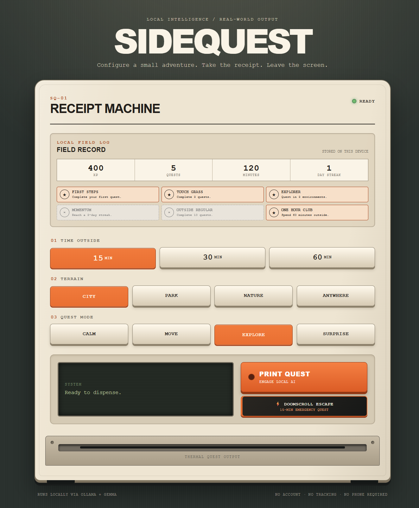
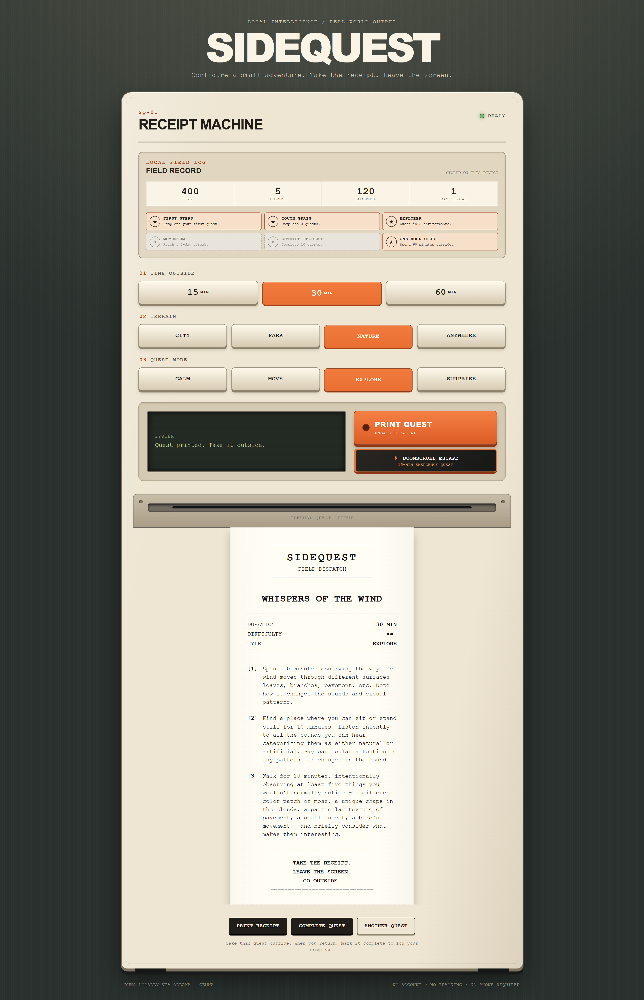

# 🌿 SIDEQUEST

**Print a quest. Leave the screen. Touch grass.**

### A screenless-first AI quest machine, designed for the physical world.

SIDEQUEST is the software prototype of a future **physical AI-powered quest dispenser** — a small desk device that generates personalized real-world adventures and prints them on thermal paper.

The vision is simple: **press a button, receive a quest, and walk away from your screen.** No endless feeds, no notifications, no app demanding your attention.

The current implementation is a browser-based simulation of that device, powered by a locally running open-weight AI model. It brings together the quest generation engine, receipt-style interface, and gamification system — with the long-term goal of moving the experience into dedicated hardware.

**AI that gets you offline, not AI that keeps you online.**

Built for the **Hacktoberfest 2026 — Touch Grass Challenge**.

## Demo

https://github.com/user-attachments/assets/d3117a55-5f4a-42ad-a658-3522ca035141

## Preview



### Your next adventure, printed



## The idea

We have apps for productivity, entertainment, fitness, and tracking every minute of our lives. But sometimes the hardest thing is simply closing the laptop and going outside.

SIDEQUEST turns a vague intention — _"I should go for a walk"_ — into a small, achievable mission.

Choose your time, environment, and mood. A local AI model generates a personalized quest with three objectives. The quest appears as a retro-style printed receipt.

Take your quest. Leave the screen behind. Come back when you're done.

**The goal isn't more screen time. It's more life outside the screen.**

## How it works

**1. Choose your adventure**

Configure three things:

- **Duration:** 15, 30, or 60 minutes
- **Environment:** City, Park, Nature, or Anywhere
- **Mode:** Calm, Move, Explore, or Surprise

**2. Generate a quest**

SIDEQUEST uses **Gemma 3 4B**, running locally through Ollama, to create a quest with a title, difficulty rating, and exactly three real-world objectives.

**3. Print your mission**

Your quest appears as a receipt from a fictional physical quest machine. Print it on paper or use the browser's print function.

**4. Go outside**

Complete the objectives away from your screen.

**5. Log your adventure**

Return to mark your quest complete, earn XP, unlock badges, and build a daily streak.

## Features

### 🧾 Receipt Machine

A retro-inspired interface designed around the idea of a future physical quest dispenser.

- Animated receipt generation
- Responsive layout
- Printable quests
- Minimal interaction before heading outside

### 🧠 Local AI Quest Generation

- Powered by the open-weight **Gemma 3 4B** model
- Runs locally using **Ollama**
- Generates structured quests for different environments and activity modes
- Validates generated quests against a defined schema

### 🎮 Gamification

Every completed quest contributes to your field record.

| Quest duration | XP earned |
| -------------- | --------: |
| 15 minutes     |     50 XP |
| 30 minutes     |    100 XP |
| 60 minutes     |    200 XP |

Track completed quests, total XP, time spent outside, and daily streaks.

Unlock six achievements:

| Badge           | How to unlock                               |
| --------------- | ------------------------------------------- |
| FIRST STEPS     | Complete your first quest                   |
| TOUCH GRASS     | Complete 3 quests                           |
| EXPLORER        | Complete quests in 3 different environments |
| MOMENTUM        | Reach a 3-day streak                        |
| OUTSIDE REGULAR | Complete 10 quests                          |
| ONE HOUR CLUB   | Accumulate 60 minutes outside               |

### 📵 Doomscroll Escape

Caught in an endless scrolling session?

Hit **Doomscroll Escape** to instantly request a 15-minute surprise quest that works anywhere.

No planning. Just a reason to put the phone down.

### 💾 Persistent Progress

SIDEQUEST uses SQLite to store quests and progress locally.

- Unfinished quests survive page refreshes and backend restarts
- Completed quests are recorded persistently
- XP cannot be awarded twice for the same quest
- Daily streaks are based on local calendar dates

## Tech stack

| Layer           | Technology                                |
| --------------- | ----------------------------------------- |
| Backend         | Python 3.12, FastAPI                      |
| AI model        | Gemma 3 4B                                |
| Local inference | Ollama                                    |
| Validation      | Pydantic                                  |
| Database        | SQLite                                    |
| Frontend        | Vanilla JavaScript, ES Modules, HTML, CSS |
| Testing         | pytest, Node.js test runner               |
| Python tooling  | uv                                        |

No frontend framework or JavaScript build step required.

## Run locally

### Prerequisites

Install:

- Python 3.12 or newer
- [uv](https://docs.astral.sh/uv/)
- [Ollama](https://ollama.com/)
- Node.js (for frontend tests)

### 1. Clone the repository

```bash
git clone https://github.com/fedachkaa/sidequest.git
cd sidequest
```

### 2. Download the AI model

```bash
ollama pull gemma3:4b
```

### 3. Start Ollama

```bash
ollama serve
```

If Ollama is already running, you can skip this step.

### 4. Start SIDEQUEST

Open another terminal:

```bash
uv run uvicorn app.main:app --reload
```

Visit **http://127.0.0.1:8000/**.

Your quest machine is ready.

### 5. Run tests

```bash
uv run pytest -q
node --test tests/frontend_progress.test.js
```

## Local data and privacy

SIDEQUEST is designed around local-first AI.

Quest generation runs through a locally hosted Ollama model rather than requiring a cloud AI API.

Generated quests and progress are stored in a local SQLite database at:

```text
data/sidequest.db
```

You can override the database location with the `SIDEQUEST_DB_PATH` environment variable.

Daily streaks follow the calendar date of the machine running SIDEQUEST, with day boundaries at local midnight.

## Architecture

```text
Browser
  |
  |-- Receipt Machine UI
  |-- Quest controls
  |-- Progress and badges
  |
  v
FastAPI
  |
  |-- Quest generation service
  |     |
  |     v
  |   Ollama → Gemma 3 4B
  |
  |-- Progress service
  |     |
  |     v
  |   SQLite
  |
  v
Validated quest + persistent progress
```

The backend handles quest generation, validation, persistence, and gamification. The frontend handles user interaction and the receipt-machine experience.

## The bigger vision

SIDEQUEST is currently a **web-based prototype of a future physical device**.

Imagine a small machine sitting on your desk, next to your keyboard. When you've been working or scrolling for too long, you press a button.

A tiny receipt comes out:

**YOUR NEXT SIDE QUEST**

Three objectives. Fifteen minutes. No notifications. No endless feed.

Just you and the world outside.

The web prototype explores the AI quest engine, game mechanics, and receipt-based interaction before building physical hardware.

## Built for Hacktoberfest 2026

SIDEQUEST was created for the **Touch Grass Challenge**, exploring how open-weight AI can encourage meaningful experiences away from screens.

Instead of using AI to keep people engaged with another digital product, SIDEQUEST uses AI to help people disconnect.

**Less scrolling. More exploring.**

---

Made with Python, local AI, and a little motivation to go outside.
